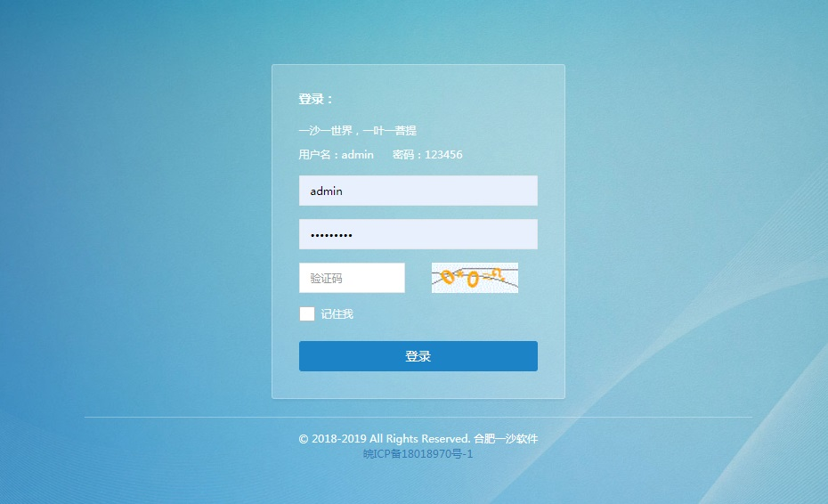
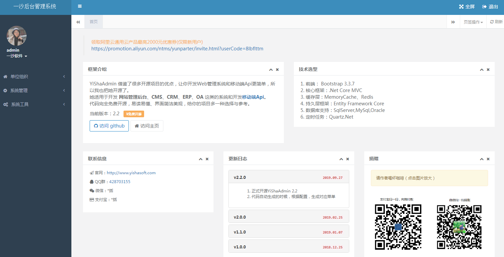
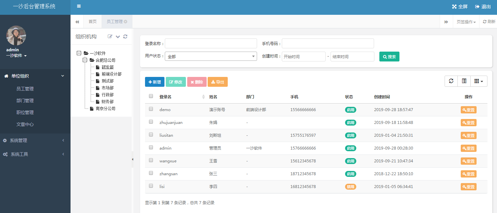
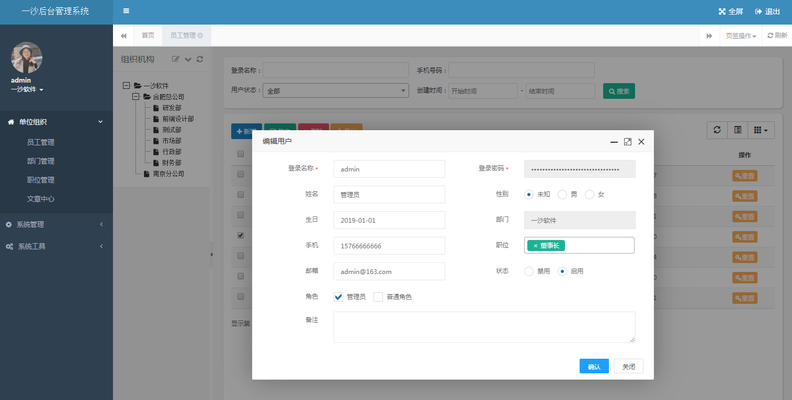
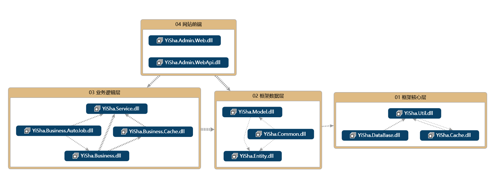

# YiShaAdmin

## 简言

YiShaAdmin 基于.NET Core 开发，借鉴了很多开源项目的优点，让你开发 Web 管理系统和移动端 Api 更简单，所以我也把她开源了。
 
她可以用于所有的 Web 应用程序，例如网站管理后台、CMS、CRM、ERP、OA 这类的系统和移动端 Api。

## 版本

| YiShaAdmin 版本 | .NET Core 版本                                                         | 状态   | 是否支持 |
| :-------------- | :--------------------------------------------------------------------- | :----- | -------- |
| 6.0             | [6.0](https://github.com/liukuo362573/YiShaAdmin/tree/YiShaAdmin-Net6) | 进行中 | 支持     |
| 3.1             | [3.1](https://github.com/liukuo362573/YiShaAdmin/releases/tag/v3.1)    | 当前   | 支持     |
| 2.2             | [2.2](https://github.com/liukuo362573/YiShaAdmin/releases/tag/v2.2)    | 归档   | 支持     |

## 演示图

## 在线体验

1. 项目地址：[http://106.14.124.170/admin](http://106.14.124.170/admin)
2. 账号密码：admin 123456

## 内置功能

- 员工管理：员工是系统操作者，该功能主要完成系统用户配置
- 部门管理：配置系统组织机构（公司、部门、小组）
- 职位管理：配置系统用户所担任职务
- 文章中心：管理新闻及公司案例
- 角色管理：角色菜单权限分配，角色对应权限，员工属于某个角色
- 菜单管理：配置系统菜单，操作权限，按钮权限标识
- 通用字典：系统里动态改变的数据，像文章类型，用字典进行维护，不变的数据，可以用枚举
- 行政区划：全国的省市县三级数据，展示树形数据的使用
- 系统日志（登录日志、操作日志、Api 日志）：查看系统的登录、操作、Api 调用日志
- 定时任务：在线（添加、修改、删除）任务调度，包含执行结果日志
- 系统 Api：Api 文档与测试工具
- 数据表管理：查看当前数据库所有表、字段及记录总数
- 代码生成：快速生成对单表的增删改查
- 服务器信息：查看服务器的基本信息

## 开发

### 文档

文档地址：[http://106.14.124.170/doc](http://106.14.124.170/doc)

### 结构图

### 贡献

您的任何贡献都是值得肯定的，我们在此**衷心感谢**！

1. Fork 本项目
2. 创建开发分支 (`git checkout -b dev`)
3. 提交更改 (`git commit -m 'Add something'`)
4. 推送到分支 (`git push origin dev`)
5. 提 [Pull Request](https://github.com/liukuo362573/YiShaAdmin/compare)

## 许可证

[MIT](https://github.com/liukuo362573/yishaadmin/blob/master/LICENSE)
