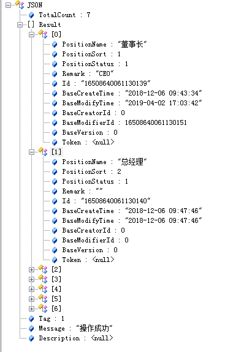

## 数据格式

为了统一，后端响应的数据类型都是<code>TData</code>或者泛型<code>TData&lt;T&gt;</code>类型的json数据，T为泛型，可以是List类型或是Object类型的数据。

* 如果是简单数据的状态返回，可以使用<code>TData</code>类型，有Tag、Message、Description这3个属性。
```csharp
    public class TData
    {
        /// <summary>
        /// 操作结果，Tag为1代表成功，0代表失败，其他的验证返回结果，可根据需要设置
        /// </summary>
        public int Tag { get; set; }

        /// <summary>
        /// 提示信息或异常信息
        /// </summary>
        public string Message { get; set; }

        /// <summary>
        /// 扩展Message
        /// </summary>
        public string Description { get; set; }
    }
```
* 如果是复杂数据的状态返回，可以使用泛型类型的<code>TData&lt;T&gt;</code>，它继承自TData。
  当需要返回一条记录的时候，TotalCount属性不使用，当需要返回分页数据的时候，TotalCount属性为总记录数，Result属性存放需要返回的数据。
```csharp
    public class TData<T> : TData
    {
        /// <summary>
        /// 列表的记录数
        /// </summary>
        public int TotalCount { get; set; }

        /// <summary>
        /// 数据
        /// </summary>
        public T Result { get; set; }
    }
```
注意看类属性上面的注释，对各个属性的作用都有解释，比如属性Tag成功为1，失败为0（int型默认就是0，失败时可以不用赋值，成功时才要赋值），
这是一种默认的约定，实际开发可以按照这种约定，方便统一控制。

## 分页实现

1. 前端通过组件<code>ysTable</code>来显示表格

```javascript
   $(function () {
        initGrid();
    });

    function initGrid() {
        var queryUrl = '@Url.Content("~/OrganizationManage/Position/GetPageListJson")';
        $('#gridTable').ysTable({
            url: queryUrl,
            sortName: 'PositionSort',
            sortOrder: 'Asc',
            columns: [
                { checkbox: true, visible: true },
                { field: 'Id', title: 'Id', visible: false },
                { field: 'PositionName', title: '职位名称', width: "15%", sortable: true },
                { field: 'PositionSort', title: '显示顺序', width: "15%", sortable: true },
                {
                    field: 'BaseModifyTime', title: '创建时间', formatter: function (value, row, index) {
                        return ys.formatDate(value, "yyyy-MM-dd HH:mm:ss");
                    }
                }
            ],
            queryParams: function (params) {
			    // 获取分页参数
                var pagination = $('#gridTable').ysTable('getPagination', params); 
				// 获取界面搜索条件
                var queryString = $("#searchDiv").getWebControls(pagination); 
                return queryString;
            }
        });
    }
```
<code>searchDiv</code> 是一个大的div，里面是搜索条件控件。

2. 后端Controller

```csharp
        [HttpGet]
        [AuthorizeFilter("organization:position:list")]
        public async Task<IActionResult> GetPageListJson(PositionListParam param, Pagination pagination)
        {
            TData<List<PositionEntity>> obj = await sysPositionBLL.GetPageList(param, pagination);
            return Json(obj);
        }
```
* <code>AuthorizeFilter</code>继承自<code>ActionFilterAttribute</code>，作用是对Action进行权限校验，<code>organization:position:list</code>为<code>GetPageListJson</code>这个Action对应的权限标识。

* <code>GetPageListJson</code>方法的第一个参数<code>PositionListParam</code>会自动映射传入的搜索条件参数，第二参数<code>PositionListParam</code>会自动映射传入的分页条件。

* 响应的数据为Json格式：



* 搜索条件映射成Sql语句有2种写法，第一种是把输入条件参数转成Expression表达式树，适合简单的Sql查询，第二种是拼接原生Sql，适合复杂的Sql查询。

  1 ) 第一种转成Expression表达式树写法
  ```csharp
        private Expression<Func<PositionEntity, bool>> ListFilter(PositionListParam param)
        {
            var expression = LinqExtensions.True<PositionEntity>();
            if (param != null)
            {
                if (!string.IsNullOrEmpty(param.PositionName))
                {
                    expression = expression.And(t => t.PositionName.Contains(param.PositionName));
                }
                if (!string.IsNullOrEmpty(param.PositionIds))
                {
                    long[] positionIdArr = CommonHelper.SplitToArray<long>(param.PositionIds, ',');
                    expression = expression.And(t => positionIdArr.Contains(t.Id.Value));
                }
            }
            return expression;
        }
```
  调用方法如下：
```csharp
        public async Task<List<PositionEntity>> GetPageList(PositionListParam param, Pagination pagination)
        {
            var expression = ListFilter(param);
            var list = await this.BaseRepository().FindList(expression, pagination);
            return list.ToList();
        }
```
  2 ) 第二种拼接原生Sql写法
```csharp
        private List<DbParameter> ListFilter(LogApiListParam param, StringBuilder strSql)
        {
            strSql.Append(@"SELECT  a.id as Id,
                                    a.base_modify_time as BaseModifyTime,
                                    a.base_modifier_id as BaseModifierId,
                                    a.log_status as LogStatus,
                            FROM    sys_log_api a
                                    LEFT JOIN sys_user b ON a.base_modifier_id = b.id
                                    LEFT JOIN sys_department c ON b.department_id = c.id
                            WHERE   1 = 1");
            var parameter = new List<DbParameter>();
            if (param != null)
            {
                if (!string.IsNullOrEmpty(param.UserName))
                {
                    strSql.Append(" AND b.user_name like @UserName");
                    parameter.Add(DbParameterExtension.CreateDbParameter("@UserName", '%' + param.UserName + '%'));
                }          
            }
            return parameter;
        }
```
  调用方法如下：
```csharp
        public async Task<List<LogApiEntity>> GetPageList(LogApiListParam param, Pagination pagination)
        {
            var strSql = new StringBuilder();
            List<DbParameter> filter = ListFilter(param, strSql);
            var list = await this.BaseRepository().FindList<LogApiEntity>(strSql.ToString(), filter.ToArray(), pagination);
            return list.ToList();
        }
```

## Excel导出

Excel导出使用开源项目<code>NPOI</code>进行处理，可以根据界面的搜索条件，后台设置需要导出的列，导出所有符合条件的记录。

1. 前端写法

```javascript
<a id="btnExport" class="btn btn-warning" onclick="exportForm()"><i class="fa fa-download"></i> 导出</a>

function exportForm() {
    var url = '@Url.Content("~/OrganizationManage/User/ExportJson")';
    var postData = $("#searchDiv").getWebControls();
    ys.exportExcel(url, postData);
}
```

2. 后端写法

```csharp
[HttpPost]
public async Task<IActionResult> ExportJson(UserListParam param)
{
    TData<string> obj = new TData<string>();
    TData<List<UserEntity>> userObj = await userBLL.GetList(param);
    if (userObj.Tag == 1)
    {
        string file = new ExcelHelper<UserEntity>().ExportToFile("用户列表.xls",
                                                                    "用户列表",
                                                                    userObj.Result,
                                                                    new string[] { "UserName", "RealName" });
        obj.Result = file;
        obj.Tag = 1;
    }
    return Json(obj);
}
```

方法<code>ExportToFile</code>的第一个参数是Excel文件名，第二个参数是Excel的表头，第三个参数是数据源，第四个参数是导出的列（列名会自动映射为实体类上面的Description属性）

 

## 文件或图片上传

管理后台上传的图片或文件可能也需要在<code>Api</code>项目能够访问，考虑到文件的统一管理，后台的文件默认是上传到<code>Api</code>项目里的。

<code>YiSha.Admin.Web</code>项目里的配置文件appsetting.json中的<code>HttpFile</code>节点就是配置管理后台上传文件的地址，所以如果管理后台和<code>Api</code>
不在一个域名下，就涉及到跨域上传。当然，<code>Api</code>项目通过配置是支持跨域请求的，
在<code>Api</code>项目的配置文件appsetting.json中的<code>AllowCorsSite</code>节点就是配置允许的跨域站点来请求<code>Api</code>。

<blockquote>使用流程</blockquote>

1. 前端图片上传
```javascript
function uploadThumbImage(file, callback) {
    var formdata = new FormData();
    formdata.append("file", file);
    ys.ajaxUploadFile({
        url: '@GlobalContext.SystemConfig.HttpFile' + '/File/UploadFile?fileModule=@UploadFileType.News.ParseToInt()',
        data: formdata,
        success: function (obj) {
            if (obj.Tag == 1) {
                if (callback) {
                    callback('@GlobalContext.SystemConfig.HttpFile' + obj.Result);
                }
            }
            else {
                ys.msgError(obj.Message);
            }
        }
    })
}
```

完成代码，可以参考<code>News/NewsForm.cshtml</code>页面，方法<code>uploadThumbImage</code>的参数file就是<code>&lt;input type='file' /&gt; </code>控件的属性files数组的值。

2. 后端上传处理

上面代码里url中的<code>/File/UploadFile</code>就是后端处理上传的<code>Controller</code>，代码如下，参数<code>fileModule</code>表示上传到哪个模块，就是放到哪一类文件夹中。
```javascript
[HttpPost]
public async Task<TData<string>> UploadFile(int fileModule, IFormCollection files)
{
    TData<string> obj = await FileHelper.UploadFile(fileModule, files.Files);
    return obj;
}
		```


## 日志和异常处理

日志分三类，登录日志、操作日志、Api日志。

日志记录采用异步的方式 Insert 到日志表中，每个调用的耗时也会记录下来，方便查看哪些调用比较耗时。
如果调用异常了，会插入一条失败的日志记录，并且异常信息会记录下来，方便debug  ^_^

1. 登录日志：用户登录或退出系统，都会插入一条日志记录，对应的表为<code>sys_log_login</code>。

2. 操作日志：用户在后台查看、新增、修改、删除数据都会插入一条日志记录，对应的表为<code>sys_log_operate</code>。

3. Api日志：Api调用每个方法的调用都会插入一条日志记录，对应的表为<code>sys_log_api</code>。

## 权限控制

系统是由页面组成的，每个页面对应一个权限标识，页面包含按钮，每个按钮同样对应一个权限标识，下面以<code>OrganizationMange</code>模块下的<code>News</code>页面为例。

1. 页面权限

页面<code>OrganizationManage/News/NewsIndex</code>，对应的权限标识为<code>organization:news:view</code>。

2. 按钮权限

页面包含增删改查按钮，增加对应的权限标识为<code>organization:news:add</code>， 修改对应的权限标识为<code>organization:news:edit</code>
删除对应的权限标识为<code>organization:news:delete</code>， 查看对应的权限标识为<code>organization:news:list</code>。

<blockquote>注意事项</blockquote>

1) 前台权限限制

当用户进入到系统的主页面<code>/Home/Index</code>时，通过<code>yisha-data.js</code>会把当前用户所有的权限加载进来，针对<code>toolbar</code>类型的按钮，
如果没有权限，按钮会被自动移除掉。按钮的命名需要和权限标识对应起来，例如权限标识<code>organization:news:add</code>对应在页面的按钮是<code>btnAdd</code>，
遵循这样的命名，框架会根据按钮的id找权限，找不到权限，按钮会被自动移除掉。

这是前台的权限限制，一般来说，在前台做这种限制，可以限制在系统操作的正常用户，如果有不友好的朋友，模拟抓包请求没有权限的接口，
所以后台也需要做权限限制。

```javascript
<div class="btn-group-sm hidden-xs" id="toolbar">
      <a id="btnAdd" class="btn btn-success" onclick="showSaveForm(true)"><i class="fa fa-plus"></i> 新增</a>
      <a id="btnEdit" class="btn btn-primary disabled" onclick="showSaveForm(false)"><i class="fa fa-edit"></i> 修改</a>
      <a id="btnDelete" class="btn btn-danger disabled" onclick="deleteForm()"><i class="fa fa-remove"></i> 删除</a>
</div>
```

1) 后台权限限制

在每个<code>Action</code>方法上加<code>AuthorizeFilter("")</code>这个Attribute，多个权限标识字符串用逗号隔开。
```csharp
[HttpPost]
[AuthorizeFilter("organization:news:add,organization:news:edit")]
public async Task<IActionResult> SaveFormJson(NewsEntity entity)
{
    TData<string> obj = await newsBLL.SaveForm(entity);
    return Json(obj);
}
```

## 定时任务
在实际开发Web项目时，有一类不可缺少的，那就是定时任务。定时任务的场景可以说非常广泛，比如某些视频网站，购买会员后，每天会给会员送成长值，
每月会给会员送一些电影券；比如定时备份数据库、发送邮件、清理数据等。所以我们提供方便友好的Web界面，实现动态管理任务，可以达到控制定时任务
启动、暂停、重启、删除、添加、修改等操作，极大地方便了开发过程。

<blockquote>使用流程</blockquote>

1. 新建定时任务数据库记录

  在 系统管理-> 定时任务 中新建一个任务，<code>任务名称</code> 用来唯一的区分一个任务。

2. 新建定时任务类
 
  在YiSha.Business.AutoJob项目的Job文件夹，建一个任务类，继承自接口<code>IJobTask</code>，在任务类里面写业务代码。

3. 加入到 <code>JobExecute</code>

   在 <code>JobExecute</code> 类的 <code>Execute</code> 方法，加一个case分支，case的名称就是第一步建的<code>任务名称</code>。
```csharp
switch (context.JobDetail.Key.Name)
{
    case "数据库备份":
        obj = await new DatabasesBackupJob().Start();
        break;

	case "任务名称":
        // do job
        break;
}
```

## Api接口

Api 对应的项目为<code>YiSha.Admin.WebApi</code>，使用<code>Swagger</code>来查看文档及测试。

1. 在控制层 <code>Controller</code> 中添加特定的Attribute来描述接口信息或是验证。
```csharp
    [Route("[controller]/[action]")]
    [ApiController]
    [AuthorizeFilter]
    public class NewsController : ControllerBase
```
<code>AuthorizeFilter</code>是自定义的Attribute，用来验证调用者是否有整个Controller的权限。

2. 在<code>Action</code>中配置方法的Request Method
```csharp
  [HttpGet]
  public async Task<TData<List<NewsEntity>>> GetPageList([FromQuery] NewsListParam param, [FromQuery] Pagination pagination)

  [HttpPost]
  public async Task<TData<string>> SaveForm([FromBody]NewsEntity entity)
```

3. 在 系统管理-> 系统Api 中查看Api文档及测试接口。

## 代码生成

大部分项目里其实有很多代码是重复的，几乎每个基础模块的代码都有增删改查（CRUD）的功能，而这些功能都是大同小异的，
每个功能对应的View、Controller、Business、Service、Model文件结构也是一致的。
如果这些功能都要自己动手写，将会大大浪费我们的精力降低效率，所以这种重复性的代码和创造文件的工作可以使用代码生成。

<blockquote>注意事项</blockquote>
代码生成只生成单表的增删改查，如果需要复杂的多表操作，可以在生成的单表代码基础上修改。

<blockquote>使用流程</blockquote>

1. 新建数据库表结构

  手动创建或是用脚本创建表，创建之后，可以在 系统工具-> 代码生成 页面看到创建的表。

2. 生成代码基本配置

  选择刚刚创建的表，点击生成，会弹出一个生成代码界面，控件的 <font color='red'>*</font> 表示为必填项。

  <font color='red'>类名前缀</font> 如果没有特殊需求，可以默认，不用修改，它是根据数据库表名生成的。

  <font color='red'>输出到所在模块</font> 此下拉框里面的值，是读取<code>YiSha.Admin.Web</code>项目的<code>Areas</code>目录里面的文件夹，如果要生成到一个新模块，可以添加一个新文件夹，注意模块名的后缀是Manage。

3. 列表页编辑
   
   在这个页面，可以选择列表页是否需要搜索、是否需要工具栏、列表需要显示哪些字段、列表是否需要分页等，设置好之后，代码生成工具会按需生成。

4. 表单页编辑

   在这个页面，可以选择表单页需要显示哪些字段、显示方式等，设置好之后，代码生成工具会按需生成。

5. 代码预览 

   在这个页面，可以看到即将生成的所有代码，代码会自动生成到对应模块的目录下，如果文件已经存在，就不产生新文件。

  
  